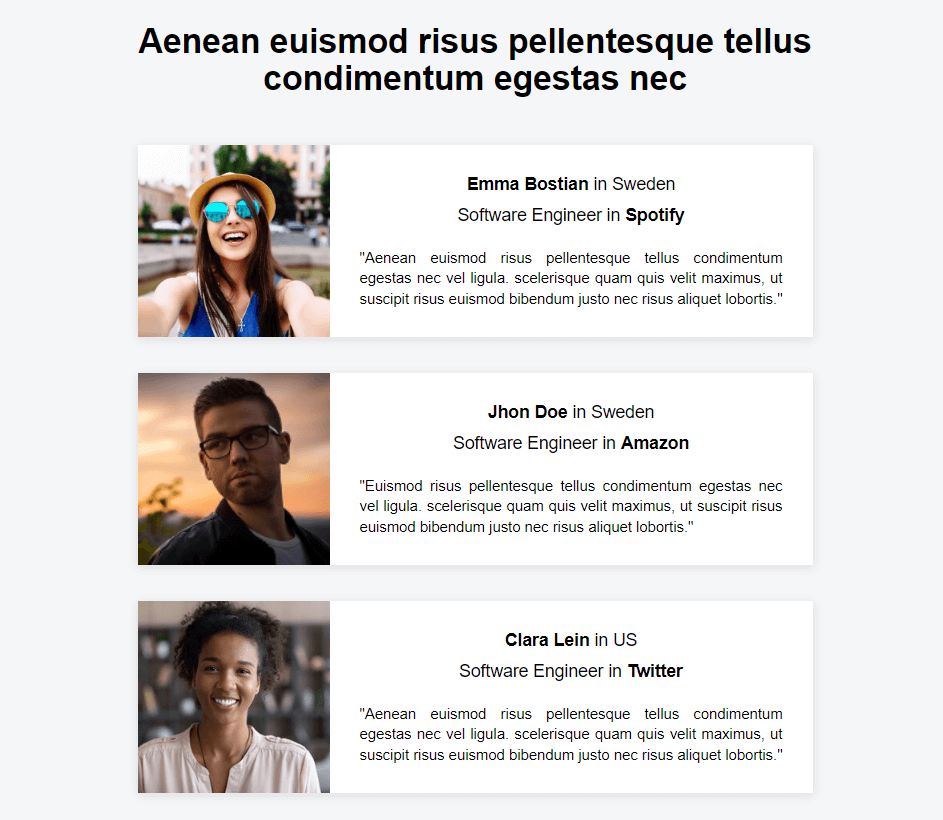

# Testimonial App

> A static React app.

Nothing special here, just my first React app in which I create a simple component with static data.

## Built With

- React
- CSS

## Getting Started

**If you want to run this project locally follow the next simple steps**

### Prerequisites

- NodeJs
- A copy of the project

### Setup

- Get a copy of the project `https://github.com/me-skit/react-testimonials.git`.
- Inside the proejct folder run `npm install` in order to get the dependencies.
- Start a local server using the `npm start`.
- Use the `http://localhost:3000` in a web browser to check it out.

## Author

👤 **Meme**

- Github: [@me-skit](https://github.com/me-skit)
- Linkedin: [linkedin](https://www.linkedin.com/in/manuel-elias/)

## 🤝 Contributing

Contributions, issues and feature requests are welcome!

Feel free to check the [issues page](https://github.com/me-skit/react-testimonials/issues).

## Show your support

Give a ⭐️ if you like this project!

## 📝 License

This project is not licensed.